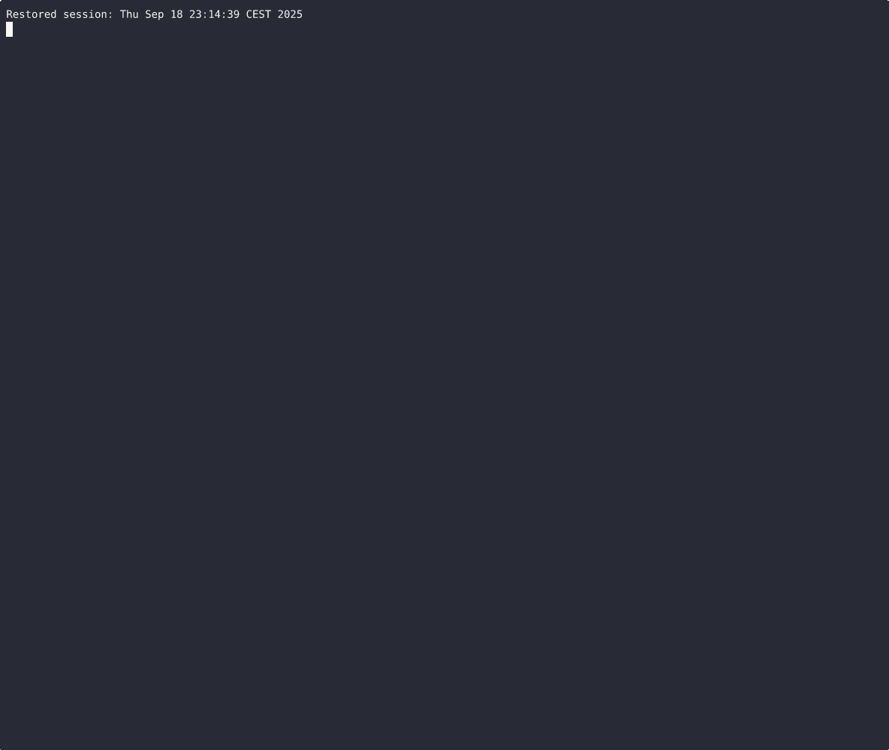

# zsh-llm-mode

Interactive LLM scratchpad for your Zsh.  
Toggle into a prompt where you can draft multi-line queries, send them to an LLM, and stream replies directly in your shell.

---

## Features
- Toggle between shell and LLM mode with **Ctrl-Q**
- Takes your entered shell command into a prompt
- Multi-line editing in LLM mode (**Ctrl-J** inserts a newline)
- Cancel with **Esc** or **Ctrl-C**
- Spinner while waiting for first response
- Streamed output from your llm tool
- Works with any CLI LLM (Ollama, sgpt, etc.)

---

## Quick Demo
Interactive LLM scratchpad for Zsh — toggle into query mode and stream answers inline.


---

## Installation

Clone and source manually:

```zsh
git clone https://github.com/oleks-dev/zsh-llm-mode.git ~/.zsh-llm-mode
echo "source ~/.zsh-llm-mode/zsh-llm-mode.plugin.zsh" >> ~/.zshrc
```

Or with a plugin manager:

```zsh
# zinit
zinit light oleks-dev/zsh-llm-mode

# antidote
antidote bundle oleks-dev/zsh-llm-mode
```

---

## Setup

Set the backend command before loading the plugin:

```zsh
export ZSH_LLM_MODE_CMD='ollama run qwen3:8b --think=false --hidethinking'
```

You can change it any time, for example:

```zsh
export ZSH_LLM_MODE_CMD='sgpt --model gpt-4'
```

#### Streaming setup

By default plugin returns LLM output in full when received.
For streaming line by line you need to have `stdbuf` or `gstdbuf` which would be detected automatically.

On macOS you can install GNU coreutils and use `gstdbuf`:
```zsh
brew install coreutils
```

---

## Usage

- Ctrl-Q → toggle LLM mode
- Ctrl-J → insert newline in LLM prompt
- Enter → send query
- Esc / Ctrl-C → cancel

Example:
```text
LLM> (Enter=send, ^Q=switch, ^J=new line, Esc=cancel)
➜ ls -al what does this command do?
[LLM query]: ls -al what does this command do?
...
```

---

## Keybinding

By default, toggle LLM mode with **Ctrl-Q** (mnemonic: *Q for Question*).

If **Ctrl-Q** is taken on your system (e.g. flow control), you can either:

1. Disable flow control:
  ```zsh
  stty -ixon
  ```

2. Or rebind to another key (example: Ctrl+G):
  ```zsh
  bindkey '^G' llm-toggle
  ```

---

## License
MIT


